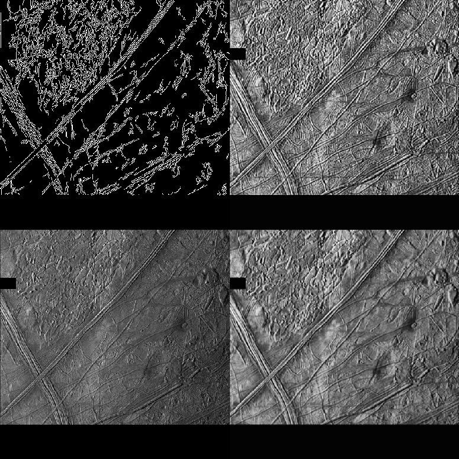

## Detection of europan cycloids and other surface features. (WIP)

<!-- To install the data, please run setup.sh:

```sh setup.sh```

This will get ~1GB of galileo image SSI data, from [OPUS](https://opus.pds-rings.seti.org/) -->
Data is obtained through [OPUS](https://opus.pds-rings.seti.org/opus/#/instrument=Galileo+SSI&target=Europa&cols=opusid,instrument,planet,target,time1,observationduration&widgets=instrument,observationtype,target&order=time1,opusid&view=browse&browse=gallery&cart_browse=gallery&startobs=496&cart_startobs=1&detail=)
### Canny Edge Detection

(Europa-Canny-Tuning.py)


Bottom Left: Input image
Bottom Right: Preprocessing
Top Right: filters
Top Left: Canny edge detection

In total, these are all the filters applied:
- CLAHE
- Gaussian Blur
- Considered but removed: Erosion & Dilation morphological filters.
- Unsharpen
- Canny edge detection w/ variable thresholds

### Next steps:
- Edge annotation,
- Curvatures after canny edge detection
- Variable image size
